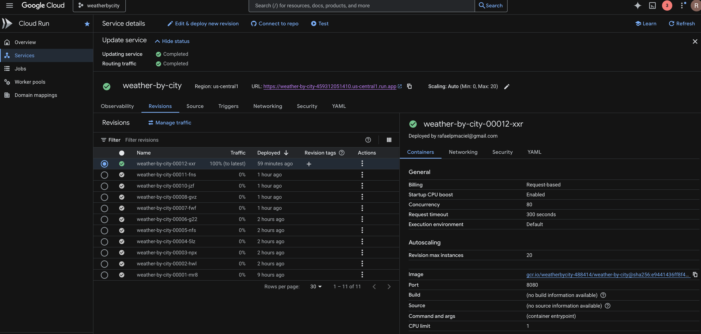
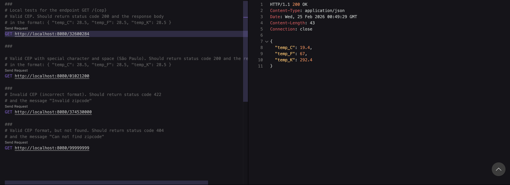

# Sistema de Temperatura por CEP

Este repositório contém a implementação de uma API em Go para consulta de temperatura por CEP. A aplicação identifica a cidade a partir do CEP e retorna temperatura em Celsius, Fahrenheit e Kelvin.

## Objetivo

Implementar e disponibilizar um serviço HTTP que:

- receba um CEP válido (8 dígitos);
- consulte a localidade via ViaCEP;
- consulte o clima atual via WeatherAPI;
- retorne as temperaturas convertidas;
- seja executável localmente (Go e Docker) e publicado no Google Cloud Run.

## Regras de negócio e respostas esperadas

- **Sucesso**
    - HTTP 200
    - Body: `{ "temp_C": 28.5, "temp_F": 83.3, "temp_K": 301.5 }`
- **CEP inválido (formato incorreto)**
    - HTTP 422
    - Mensagem: `invalid zipcode`
- **CEP não encontrado**
    - HTTP 404
    - Mensagem: `can not find zipcode`

## Tecnologias utilizadas

- Go
- Chi Router
- Testify
- Docker / Docker Compose
- Google Cloud Run
- ViaCEP API: https://viacep.com.br/
- WeatherAPI: https://www.weatherapi.com/

## Execução local

### 1) Via Go

Na raiz do projeto:

```bash
go mod tidy
go run cmd/server/main.go
```

API disponível em `http://localhost:8080/{cep}`.

### 2) Via Docker

```bash
docker build -t xavierpms/weather-by-city:latest -f Dockerfile .
docker run --rm -p 8080:8080 xavierpms/weather-by-city:latest
```

### 3) Via Docker Compose

```bash
docker-compose up -d
docker ps
```

## Testes automatizados

Para executar todos os testes do projeto:

```bash
go test -count=1 ./...
```

Para rodar com saída detalhada:

```bash
go test -v ./...
```

## Cobertura de testes

Cobertura obtida com o comando:

```bash
go test -cover ./...
```

Resultado atual por pacote:

- `github.com/xavierpms/weather-by-city/cmd/server`: **0.0%**
- `github.com/xavierpms/weather-by-city/internal/config`: **95.7%**
- `github.com/xavierpms/weather-by-city/internal/domain`: sem arquivos de teste
- `github.com/xavierpms/weather-by-city/internal/infra/repository`: **0.0%**
- `github.com/xavierpms/weather-by-city/internal/infra/validator`: **100.0%**
- `github.com/xavierpms/weather-by-city/internal/infra/webserver/handlers`: **87.0%**
- `github.com/xavierpms/weather-by-city/internal/usecase`: **0.0%**

## Teste de endpoint (arquivo HTTP)

O arquivo `api/apis_temperature_cep.http` pode ser utilizado no VS Code para chamadas rápidas de teste da API.

## Deploy no Google Cloud Run

Serviço publicado em:

`https://weather-by-city-459312051410.us-central1.run.app/{zipcode}`

Visão do serviço em execução no Cloud Run:



Exemplo de chamadas realizadas contra o serviço publicado:



Exemplos:

```bash
# CEP válido
curl -i https://weather-by-city-459312051410.us-central1.run.app/32600284

# CEP inválido
curl -i https://weather-by-city-459312051410.us-central1.run.app/324510000

# CEP com formato válido, porém inexistente
curl -i https://weather-by-city-459312051410.us-central1.run.app/000000000
```


